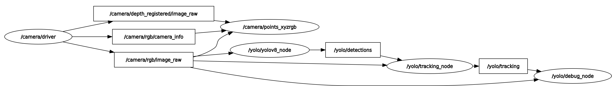

# yolo_ros

ROS 2 wrap for YOLO models from [Ultralytics](https://github.com/ultralytics/ultralytics) to perform object detection and tracking, instance segmentation, human pose estimation, Oriented Bounding Box (OBB) and image classification. There are also 3D versions of object detection, instance segmentation and human pose estimation based on depth images.

The pipeline is a pure **C++ / ONNX Runtime** implementation: there is no Python runtime and no `ultralytics` dependency at run time. It runs any Ultralytics-exported ONNX model (see [Models](#models)), and the whole repository is licensed under **MIT**.

<div align="center">

[](https://opensource.org/license/mit) [](https://github.com/mgonzs13/yolo_ros/releases) [](https://github.com/mgonzs13/yolo_ros?branch=main) [](https://github.com/mgonzs13/yolo_ros/commits/main) [](https://github.com/mgonzs13/yolo_ros/issues) [](https://github.com/mgonzs13/yolo_ros/pulls) [](https://github.com/mgonzs13/yolo_ros/graphs/contributors) [](https://github.com/mgonzs13/yolo_ros/actions/workflows/doxygen-deployment.yml?branch=main)

| ROS 2 Distro |                          Branch                          |                                                                                                         Build status                                                                                                         |                                                               Docker Image                                                                |
| :----------: | :------------------------------------------------------: | :--------------------------------------------------------------------------------------------------------------------------------------------------------------------------------------------------------------------------: | :---------------------------------------------------------------------------------------------------------------------------------------: |
|  **Humble**  | [`main`](https://github.com/mgonzs13/yolo_ros/tree/main) |  [](https://github.com/mgonzs13/yolo_ros/actions/workflows/humble-docker-build.yml?branch=main)   |  [](https://hub.docker.com/r/mgons/yolo_ros/tags?name=humble)  |
|   **Iron**   | [`main`](https://github.com/mgonzs13/yolo_ros/tree/main) |     [](https://github.com/mgonzs13/yolo_ros/actions/workflows/iron-docker-build.yml?branch=main)      |    [](https://hub.docker.com/r/mgons/yolo_ros/tags?name=iron)    |
|  **Jazzy**   | [`main`](https://github.com/mgonzs13/yolo_ros/tree/main) |    [](https://github.com/mgonzs13/yolo_ros/actions/workflows/jazzy-docker-build.yml?branch=main)    |   [](https://hub.docker.com/r/mgons/yolo_ros/tags?name=jazzy)   |
|  **Kilted**  | [`main`](https://github.com/mgonzs13/yolo_ros/tree/main) |  [](https://github.com/mgonzs13/yolo_ros/actions/workflows/kilted-docker-build.yml?branch=main)   |  [](https://hub.docker.com/r/mgons/yolo_ros/tags?name=kilted)  |
| **Lyrical**  | [`main`](https://github.com/mgonzs13/yolo_ros/tree/main) | [](https://github.com/mgonzs13/yolo_ros/actions/workflows/lyrical-docker-build.yml?branch=main) | [](https://hub.docker.com/r/mgons/yolo_ros/tags?name=lyrical) |

</div>

## Table of Contents

1. [Installation](#installation)
2. [Docker](#docker)
3. [Models](#models)
4. [Usage](#usage)
5. [Demos](#demos)
6. [Documentation](#documentation)
7. [License](#license)

## Installation

The nodes build as a standard ROS 2 `colcon` workspace. ONNX Runtime 1.20.0 is downloaded automatically by `yolo_onnxruntime_vendor` at configure time — the CPU tarball by default, the GPU tarball with `-DONNX_GPU=ON` — so the runtime is not something you install by hand.

Prerequisites and checkout, common to every backend:

```shell
# libcurl/OpenSSL headers, for the Hugging Face Hub model download
sudo apt install libcurl4-openssl-dev libssl-dev

# Clone this repo
cd ~/ros2_ws/src
git clone https://github.com/mgonzs13/yolo_ros.git

# Install rosdep dependencies
cd ~/ros2_ws
rosdep install --from-paths src --ignore-src -r -y
```

### CPU (x64 and aarch64)

```shell
colcon build --symlink-install
source install/setup.bash
```

`yolo_onnxruntime_vendor` downloads the CPU ONNX Runtime for the host architecture (x86_64 or aarch64) and the node runs on the CPU execution provider — no CUDA or cuDNN required.

### CUDA / TensorRT (x64)

```shell
# cuDNN 9 for the CUDA 12 series (required by the ONNX Runtime 1.20 GPU build)
sudo apt install libcudnn9-cuda-12

colcon build --symlink-install --cmake-args -DONNX_GPU=ON
source install/setup.bash
```

`-DONNX_GPU=ON` fetches the ONNX Runtime GPU build, which links against the CUDA 12 series at run time, so the host also needs an NVIDIA driver and a CUDA 12.x toolkit. TensorRT is opt-in: the default `provider: auto` runs on the CUDA execution provider and falls back to CPU; set `provider: tensorrt` to prefer the TensorRT EP (TensorRT → CUDA → CPU) when it is installed. `provider` and `device` are chosen at runtime — see [Parameters](#parameters). The prebuilt GPU tarball is x64-only; for CUDA/TensorRT on aarch64 and for custom ONNX Runtime builds see the [build guide](docs/build.md).

Launch from the workspace root so relative source paths resolve.

## Docker

Two Dockerfiles are provided: `Dockerfile` (CPU) and `Dockerfile.gpu` (CUDA / TensorRT, built on `nvidia/cuda:12.6.3-cudnn-runtime-ubuntu22.04` with `-DONNX_GPU=ON`).

```shell
docker build -t yolo_ros .                        # CPU image
docker build -f Dockerfile.gpu -t yolo_ros:gpu .  # CUDA / TensorRT image
```

If you want to use CUDA, install the [NVIDIA Container Toolkit](https://docs.nvidia.com/datacenter/cloud-native/container-toolkit/latest/install-guide.html) and add `--gpus all`:

```shell
docker run -it --rm --gpus all yolo_ros:gpu
```

See the [Docker guide](docs/docker.md) for the GPU details, the TensorRT engine cache and the NVIDIA runtime.

## Models

The C++ pipeline runs any Ultralytics-exported **ONNX** model whose output matches one of the YOLO layouts below. The compatible model families are:

- [YOLOv3](https://docs.ultralytics.com/models/yolov3/) (`yolov3u`, Ultralytics' updated anchor-free head)
- [YOLOv5](https://docs.ultralytics.com/models/yolov5/) (`yolov5u`)
- [YOLOv8](https://docs.ultralytics.com/models/yolov8/)
- [YOLOv9](https://docs.ultralytics.com/models/yolov9/)
- [YOLOv10](https://docs.ultralytics.com/models/yolov10/)
- [YOLOv11](https://docs.ultralytics.com/models/yolo11/)
- [YOLOv12](https://docs.ultralytics.com/models/yolo12/)
- [YOLOv26](https://docs.ultralytics.com/models/yolo26/)

Models are exported for one task — **detection** (`detect`), **instance segmentation** (`segment`), **human pose** (`pose`), **oriented bounding box** (`obb`) or **image classification** (`classify`). See the [model export guide](docs/models.md) for how to export a `.pt` checkpoint to ONNX with the `ultralytics` package, the export notes and the Hugging Face Hub download.

> **License note**: Ultralytics models and pretrained weights are **not** MIT licensed. They are released under the **AGPL-3.0** license (with commercial / enterprise licensing available from Ultralytics), so the MIT license of this repository does **not** cover them. Check the terms of the specific model you use at <https://ultralytics.com/license> — especially if you ship or deploy the model.

## Usage

Run from the workspace root (so the workspace is sourced as an overlay). For single-camera tasks there is a single launch file, `yolo.launch.py` — the task is selected by the **model**, not by a separate launch. Multi-camera pipelines use a second launch, `yolo_pipelines.launch.py` (see the [multi-camera pipelines guide](docs/pipelines.md)). The launch passes its `config/yolo.yaml` params file to the nodes (plus any command-line overrides) and makes no topic remaps.

Pick the model with `model_filename:=` (a file in the Hugging Face mirror set by `model_repo`) or `model:=` (a local path). The task is inferred from the file name (`model_type: auto`): `-seg`/`segment` → segmentation, `-pose`/`pose` → pose, `-obb`/`obb` → OBB, `-cls`/`classify` → classification, anything else detection. Each task also ships a preset params file (`config/yolo_segment.yaml`, `yolo_pose.yaml`, `yolo_obb.yaml`, `yolo_classify.yaml`) that pins `model_type` and task-specific tuning — pass it with `params_file:=`:

```shell
ros2 launch yolo_bringup yolo.launch.py params_file:=$(ros2 pkg prefix yolo_bringup)/share/yolo_bringup/config/yolo_segment.yaml
```

Runnable launch commands for each task (detection, segmentation, pose, OBB and classification) are collected in [Demos](#demos).

<p align="center">
  
</p>

### 3D Detection

Add `use_3d:=True` to the launch to also start the C++ 3D detection node, which subscribes to the depth image + `CameraInfo` and publishes `detections_3d`.

For segmentation the depth ROI is driven by the mask polygon; for pose the 2D keypoints are back-projected to 3D (`debug_kp_markers`). The 3D node can also estimate the orientation of each box (an oriented bounding box fit by PCA to a strided depth sample) when `enable_orientation` is set. When enabled, `detections_3d` carries a non-identity quaternion in each box's `center.orientation` and the box `size` is expressed along the object's own axes.

### Multi-camera pipelines

To run **one shared detector batched across several cameras**, with per-camera tracking / 3D / debug stages, use `yolo_pipelines.launch.py` and its `config/pipelines.yaml`:

```shell
ros2 launch yolo_bringup yolo_pipelines.launch.py
```

The shared detector is a dynamic-batch ONNX export; the default config downloads `dynamic/yolo26m.onnx` from the Hugging Face mirror. See the [multi-camera pipelines guide](docs/pipelines.md) for the config schema, the per-camera stages and topics, and the batching-scaling numbers.

### Topics

All topics are published under the launch namespace (default `yolo`):

- **detections**: Objects detected by YOLO using the RGB images. Each object contains a bounding box and a class name, plus a mask or a list of keypoints for segmentation/pose models.
- **tracking**: Objects detected and tracked by ByteTrack (or BoT-SORT with `tracker_type: botsort`). Each object is assigned a stable tracking ID.
- **detections_3d**: 3D objects detected (with `use_3d:=True`). YOLO results are used to crop the depth image and create 3D bounding boxes and keypoints.
- **debug_image**: Debug image showing the detected and tracked objects. It can be visualized with `rqt_image_view` or `rviz2`.
- **debug_bb_markers** / **debug_kp_markers**: RViz `MarkerArray`s driven by the 3D box / keypoint stream (e.g. when the debug node reads `detections_3d`).

### Services

- **/yolo/enable**: Service to enable or disable the detection node at runtime. Accepts a boolean value (`std_srvs/SetBool`).
- **/yolo/set_classes**: Service to restrict which classes are published, by class name (`yolo_msgs/SetClasses`). An empty list publishes every class.

### Parameters

Configuration is file-driven: `yolo.launch.py` passes its YAML params file plus any command-line overrides as `parameters=[params_file, overrides]` (with no topic remaps). The default is `config/yolo.yaml`; the per-task presets (`config/yolo_segment.yaml`, `yolo_pose.yaml`, `yolo_obb.yaml`, `yolo_classify.yaml`) are selected with `params_file:=`. The tracking node additionally layers a per-tracker config file, `config/trackers/<tracker>.yaml`, chosen by the pipeline YAML's `tracker` selector (override with `tracker:=<name|path>`); each config file sets the real `tracker_type`. In addition, **every parameter can be overridden from the command line**; an argument left unset keeps the YAML value:

```bash
ros2 launch yolo_bringup yolo.launch.py model:=/path/model.onnx threshold:=0.5 input_image_topic:=/camera/rgb/image_raw
ros2 launch yolo_bringup yolo.launch.py model_filename:=yolo26l-seg.onnx threshold:=0.6
```

Override arguments use the upstream Python launch names where one existed: `input_image_topic` → `image_topic`, `input_depth_topic` → `depth_image_topic`, `input_depth_info_topic` → `depth_info_topic`. `tracker` selects the per-tracker file (`config/trackers/<name>.yaml`), which owns `tracker_type`. Every other argument matches its parameter name. Because an empty value means "not provided", a non-empty YAML string cannot be overridden to empty from the CLI. Run `ros2 launch yolo_bringup yolo.launch.py --show-args` for the full list.

Sections are keyed by the node's fully qualified name, so the key must include the launch namespace (default `yolo`):

```yaml
/yolo/yolo_node:
  ros__parameters:
    model_type: auto
```

If you change `namespace:=`, update the matching config block names for any value you do not override on the command line. The key parameters are listed below; see `yolo_bringup/config/yolo*.yaml` for the complete set.

#### Inference node (`yolo_node`)

- **model_type**: Pipeline to run: `YOLO`/`Detect`, `Segment`, `Pose`, `OBB`, `Classify` or `auto` (default: `auto`, which infers the task from the model file name: `-seg`/`segment`, `-pose`/`pose`, `-obb`/`obb`, `-cls`/`classify`).
- **model**: Path to the ONNX model (default: machine-specific).
- **model_repo** / **model_filename** / **force_download** / **cache_dir**: Hugging Face Hub download (used instead of `model` when set). The shipped configs default to the `unileon-robotics/YOLO26-ONNX` mirror; clear `model_repo` to fall back to the local `model` path.
- **provider**: Execution provider: `auto` (CUDA → CPU fallback chain), or force `tensorrt`/`trt` (TensorRT → CUDA → CPU), `cuda` (CUDA → CPU), `cpu` (default: `auto`).
- **device**: CUDA/TensorRT device ordinal, e.g. `cuda:0`, `trt:1`, `1` (default: `cuda:0`). The `cuda:`/`trt:` prefix is accepted but `provider` selects the execution provider.
- **trt_fp16_enable**: TensorRT FP16 precision (default: `true`).
- **trt_engine_cache_enable**: Persist built TensorRT engines (default: `true`).
- **trt_engine_cache_path**: TensorRT engine cache base directory; empty → `~/.cache/yolo_ros/trt_engines/<model>` (default: empty).
- **threshold**: Detection confidence threshold (default: `0.7`).
- **iou**: IoU threshold for NMS. Re-tunes the C++ NMS for raw-output exports (segment/pose/OBB) and has no effect on baked-NMS models (default: `0.45`).
- **max_det**: Maximum number of detections per image (default: `300`).
- **enable**: Whether to start with inference enabled (default: `true`).
- **image_topic**: Input RGB image topic (default: machine-specific).
- **image_reliability**: QoS for the image topic: `0`=system default, `1`=Reliable, `2`=Best Effort (default: `2`).
- **n_threads**: CPU execution-provider threads; `-1` = auto (default: `-1`).
- **max_fps**: Cap the inference/publish rate in Hz; `0` = unlimited (default: `0`).
- **top_k**: Classification only — number of top classes to publish (default: `5`).

#### Tracking node (`tracking_node`)

- **tracker**: Selects the config file `config/trackers/<tracker>.yaml` layered over this one: `bytetrack` (default), `botsort` (XYWH Kalman filter + camera-motion compensation), or `botsort_reid` (BoT-SORT + ReID appearance; needs `reid_model`). Override from the CLI with `tracker:=<name|path>`. Each config file defines the actual **tracker_type** (the C++ implementation: `bytetrack` or `botsort`).
- **image_topic** / **image_reliability**: Tracker image input and QoS.
- **track_high_thresh**: First-stage association threshold (default: `0.25`).
- **track_low_thresh**: Second-stage threshold for low-score matches (default: `0.1`).
- **new_track_thresh**: Score above which a new track is started (default: `0.25`).
- **track_buffer**: Frames a lost track is kept alive (default: `30`).
- **match_thresh**: Association similarity threshold (IoU/cost) (default: `0.8`).
- **fuse_score**: Fuse detection score with IoU cost for matching (default: `true`).
- **gmc_method** (BoT-SORT only): Camera-motion method: `none` (default), `sparseOptFlow`, `orb` or `ecc`.
- **gmc_downscale** (BoT-SORT only): Camera-motion downscale factor (default: `2`).

#### 3D detection node (`detect_3d_node`)

- **target_frame**: Frame to transform the 3D boxes into (default: `base_link`).
- **depth_image_units_divisor**: Divisor to convert the depth image to meters (default: `1000`).
- **depth_image_topic** / **depth_info_topic** / **depth_image_reliability** / **depth_info_reliability**: Depth input, its `CameraInfo` and their QoS.
- **detections_topic**: 2D stream to lift — `tracking` or `detections`.
- **enable_orientation**: Estimate and publish the 3D box orientation (default: `false`).
- **min_seg_points_for_orientation**: Minimum valid depth points required per detection for orientation estimation (default: `20`).

#### Debug node (`debug_node`)

- **image_topic** / **image_reliability**: Image input and QoS.
- **detections_topic**: 2D stream to draw — `tracking`, `detections` or `detections_3d` (default: `tracking`).
- **markers_topic**: 3D stream used to drive the RViz markers (default: `detections_3d`).

## Demos

> The detection, segmentation, pose and 3D demos below were recorded with the earlier Python implementation. The OBB and classification demos are not yet recorded — drop the recordings at the listed paths to have them show up here.

### Object Detection

Standard behavior including ByteTrack (or BoT-SORT) object tracking.

```shell
ros2 launch yolo_bringup yolo.launch.py
```

[](https://drive.google.com/file/d/1gTQt6soSIq1g2QmK7locHDiZ-8MqVl2w/view?usp=sharing)

### Instance Segmentation

Instance masks are the borders of the detected objects, not all the pixels inside the masks.

```shell
ros2 launch yolo_bringup yolo.launch.py model_filename:=yolo26l-seg.onnx
```

[](https://drive.google.com/file/d/1dwArjDLSNkuOGIB0nSzZR6ABIOCJhAFq/view?usp=sharing)

### Human Pose

Visible persons are detected along with their skeleton keypoints.

```shell
ros2 launch yolo_bringup yolo.launch.py model_filename:=yolo26m-pose.onnx
```

[](https://drive.google.com/file/d/1pRy9lLSXiFEVFpcbesMCzmTMEoUXGWgr/view?usp=sharing)

### Oriented Bounding Box

Rotated boxes are estimated for oriented objects.

```shell
ros2 launch yolo_bringup yolo.launch.py model_filename:=yolo26m-obb.onnx
```

<!-- Demo recording pending: add ./docs/media/demo_obb.gif to display it here.
<p align="center">
  
</p>
-->

### Image Classification

Image-level ImageNet-1k labels are published as detections with an empty bbox, so tracking is off and the `yolo_classify.yaml` preset wires the debug node to the raw `detections` stream.

```shell
ros2 launch yolo_bringup yolo.launch.py params_file:=$(ros2 pkg prefix yolo_bringup)/share/yolo_bringup/config/yolo_classify.yaml use_tracking:=False
```

<!-- Demo recording pending: add ./docs/media/demo_classify.gif to display it here.
<p align="center">
  
</p>
-->

### 3D Object Detection

The 3D bounding boxes are calculated by filtering the depth image data from an RGB-D camera using the 2D bounding box.

```shell
ros2 launch yolo_bringup yolo.launch.py use_3d:=True
```

[](https://drive.google.com/file/d/1ZcN_u9RB9_JKq37mdtpzXx3b44tlU-pr/view?usp=sharing)

### 3D Object Detection (Using Instance Segmentation Masks)

The depth image data is filtered using the instance mask polygon. Only objects with a 3D bounding box are visualized in the 2D image.

```shell
ros2 launch yolo_bringup yolo.launch.py model_filename:=yolo26l-seg.onnx use_3d:=True
```

[](https://drive.google.com/file/d/1wVZgi5GLkAYxv3GmTxX5z-vB8RQdwqLP/view?usp=sharing)

### 3D Human Pose

Each keypoint is back-projected to 3D using the depth image. Only objects with a 3D bounding box are visualized in the 2D image.

```shell
ros2 launch yolo_bringup yolo.launch.py model_filename:=yolo26m-pose.onnx use_3d:=True
```

[](https://drive.google.com/file/d/1j4VjCAsOCx_mtM2KFPOLkpJogM0t227r/view?usp=sharing)

## Documentation

The C++ API reference is generated with Doxygen and published to GitHub Pages on every release:

- Latest: <https://mgonzs13.github.io/yolo_ros/>

Build it locally (Doxygen + Graphviz):

```shell
sudo apt install doxygen graphviz
doxygen .github/Doxyfile
# output: docs/doxygen/index.html
```

The guides in [`docs/`](./docs) — [build](docs/build.md), [Docker](docs/docker.md), [model export](docs/models.md), [multi-camera pipelines](docs/pipelines.md) and [benchmark](docs/benchmark.md) — are plain Markdown served directly by GitHub.

## License

The whole repository is licensed under the **MIT License**. See the root [`LICENSE`](./LICENSE) file; it applies across the repository where a package does not provide a more specific license file.

Specifically, the repository contains independently licensed ROS 2 packages:

- `yolo_ros`, `yolo_msgs`, `yolo_bringup` and `yolo_onnxruntime_vendor` are licensed under **MIT**. See each package's `LICENSE` file; third-party notices are installed with the applicable packages (`yolo_ros/THIRD_PARTY_NOTICES.md`).

The C++ pipeline adapts behavior from the original `yolo_ros` Python nodes; those contributions were authorized by their copyright holder for release in the MIT-licensed C++ pipeline (see `THIRD_PARTY_NOTICES.md`).

Model weights and exported ONNX files are separate artifacts and remain subject to their respective licenses; the MIT license for the C++ pipeline does not relicense them. In particular, Ultralytics models are AGPL-3.0 — see the [Models](#models) section.
